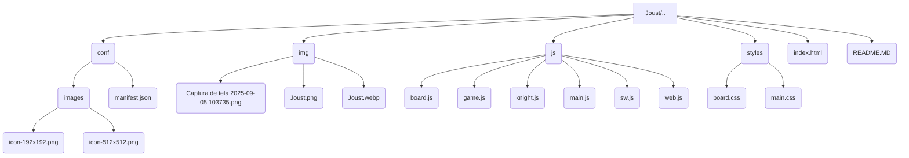
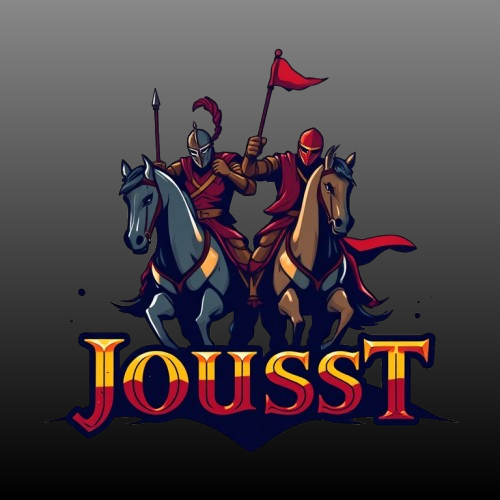

# 🐎 Joust: Um Jogo de Estratégia de Cavaleiros

---

## 📄 Descrição do Projeto

Joust é um jogo de estratégia e sobrevivência desenvolvido para a web, onde dois jogadores competem em um tabuleiro de xadrez como cavaleiros. O objetivo é ser o último cavaleiro com movimentos válidos. A cada turno, o cavaleiro deve se mover em L, como a peça do cavalo no xadrez, e a casa que ele deixa para trás é "queimada", tornando-se inutilizável pelo resto do jogo. O jogo termina quando um cavaleiro não tem mais movimentos disponíveis, e o outro jogador vence a partida.

O jogo foi construído como um PWA (Progressive Web App), permitindo que ele seja instalado em dispositivos móveis e desktop para uma experiência de jogo offline e imersiva.

---
## ✨ Funcionalidades

* **Animação de Abertura**: Uma tela de animação de introdução elegante.
* **Gameplay Dinâmico**: Jogabilidade baseada em turnos, com a mecânica única de "queimar" casas.
* **Interface Simples e Intuitiva**: Um tabuleiro de xadrez visualmente atraente com rótulos de linhas e colunas.
* **Placar Persistente**: O placar entre os dois jogadores é salvo no navegador (usando `localStorage`) para manter o registro das vitórias mesmo entre sessões.
* **Destaque de Movimentos**: As casas válidas para o cavaleiro atual são destacadas visualmente.
* **Progressive Web App (PWA)**: O jogo pode ser instalado e jogado offline, graças ao Service Worker e ao Manifesto do Aplicativo.

---

## 🎮 Como Jogar

1.  A partida começa com dois cavaleiros em posições aleatórias no tabuleiro.
2.  O Jogador 1 sempre começa.
3.  O jogador da vez deve clicar em uma das casas destacadas em verde para mover seu cavaleiro.
4.  A casa de onde o cavaleiro saiu será marcada como "queimada" (vermelha) e não pode ser usada novamente.
5.  O turno passa para o próximo jogador.
6.  A partida continua até que um dos jogadores não tenha mais movimentos válidos.
7.  O jogador que conseguir se mover por mais tempo vence a partida. O placar será atualizado.

--- 
## 🗂️ Estrutura de Arquivos

---

## 🚀 Como Executar Localmente

1.  Clone ou descarregue este repositório.
2.  Abra a pasta do projeto no Visual Studio Code.
3.  Instale a extensão **Live Server**.
4.  Clique em **"Go Live"** no canto inferior direito para iniciar o servidor local.

---

## 🎓 Contexto do Projeto

Este projeto foi desenvolvido como parte da avaliação da disciplina de **Desenvolvimento Web 2** do curso de **Tecnologia em Análise e Desenvolvimento de Sistemas** do Instituto Federal de Pernambuco (IFPE). O objetivo era construir um jogo inspirado no Jouste de tabuleiro, implementando uma lógica de jogo complexa.

---

---

**Desenvolvido por:** *[Davi Freitas]*